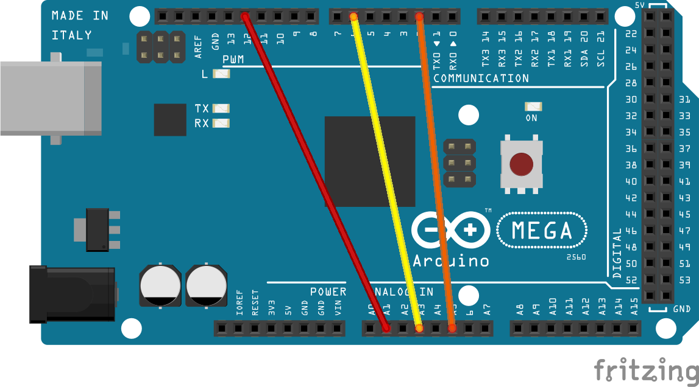

# Progetto_SO

**Setting Arduino-Mega**



## Server

Questo programma è responsabile della comunicazione con il client, della gestione dei comandi ricevuti e dell'invio dei dati richiesti.E' eseguito su un microcontrollore e comunica con il client tramite la seriale.

### UART

#### *uart.h*

uart.h è diviso in due parti :

1.**Viene configurata la comunicazione UART (Universal Asynchronous Receiver-Transmitter) su un microcontrollore.**

```C
#define BAUD 19200
#define MYUBRR (F_CPU/16/BAUD-1)
```

La riga `#define BAUD 19200` definisce una macro del preprocessore chiamata `BAUD` con un valore di `19200`. Questo valore rappresenta il baud rate per la comunicazione UART. Il baud rate è la velocità alla quale i dati vengono trasmessi su un canale di comunicazione, in questo caso è impostato a 19200 bit al secondo.

La riga successiva `#define MYUBRR (F_CPU/16/BAUD-1)` definisce un'altra macro del preprocessore chiamata `MYUBRR`. Questa macro viene utilizzata per calcolare il valore che deve essere caricato nel registro UBRR (USART Baud Rate Register) del microcontrollore per impostare il baud rate desiderato per la comunicazione UART. `F_CPU` è la frequenza di clock del microcontrollore. La formula `(F_CPU/16/BAUD-1)` proviene dal datasheet del microcontrollore per il calcolo del valore UBRR.

In sintesi, queste due righe stanno impostando il baud rate per la comunicazione UART su un microcontrollore. Il baud rate effettivo è determinato dalla frequenza di clock del microcontrollore (`F_CPU`) e dal baud rate desiderato (`BAUD`).

2.**Dichiarazioni di funzioni per la comunicazione UART Universal Asynchronous Receiver-Transmitter**

```C
/* Dichiarazione della funzione per inizializzare l'UART */ 
void UART_init(void);

/* Dichiarazione della funzione per inviare un carattere via UART */
void UART_putChar(char c);

/* Dichiarazione della funzione per ricevere un carattere via UART */
char UART_getChar(void);

/* Dichiarazione della funzione per ricevere una stringa via UART */
char UART_getString(char* buf);

/* Dichiarazione della funzione per inviare una stringa via UART */
void UART_putString(char* buf);
```

Le funzioni `UART_putChar` e `UART_putString` sono utilizzate per inviare dati via UART.

Le funzioni `UART_getChar` e `UART_getString` sono utilizzate per ricevere dati.

La funzione `UART_init` è utilizzata per inizializzare l'UART.

#### *uart.c*

In uart.c vengono implementate le funzioni che regolano la comunicazione server e client tramite seriale

```C
void UART_init(void){
  /* Set baud rate */
  UBRR0H = (uint8_t)(MYUBRR>>8);
  UBRR0L = (uint8_t)MYUBRR;
  /* 8-bit data */ 
  UCSR0C = (1<<UCSZ01) | (1<<UCSZ00); 
  /* Enable RX and TX */
  UCSR0B = (1<<RXEN0) | (1<<TXEN0);   
}

void UART_putChar(char c){
  /* wait for transmission completed, looping on status bit */
  while ( !(UCSR0A & (1<<UDRE0)) );
  /* Start transmission */
  UDR0 = c;
}

char UART_getChar(void){
  /* Wait for incoming data, looping on status bit */
  while ( !(UCSR0A & (1<<RXC0)) );
  
  /* Return the data */
  return UDR0;
}

/* reads a string until the first newline or 0 */
char UART_getString(char* buf){
  char* b0=buf; //beginning of buffer
  while(1){
    char c=UART_getChar();
    *buf=c;
    ++buf;
    // reading a 0 terminates the string
    if (c==0)
      return buf-b0;
    // reading a \n  or a \r return results
    // in forcedly terminating the string
    if(c=='\n'||c=='\r'){
      *buf=0;
      ++buf;
      return buf-b0;
    }
  }
}

void UART_putString(char* buf){
  while(*buf){
    UART_putChar(*buf);
    ++buf;
  }
}
```

### Pin di Output

Ho settato i pin 12,6,2 in output e li ho configurati tramite i corrispondenti registri.

* WGM2A = 101 for fast PWM, 8-bit, TOP = 0xFF, update OCR2A at BOTTOM, TOV1 flag set on Top
* WGM3B = 101 for fast PWM, 8-bit, TOP = 0xFF, update OCR3B at BOTTOM, TOV3 flag set on Top
* WGM4C = 101 for fast PWM, 8-bit, TOP = 0xFF, update OCR4C at BOTTOM, TOV4 flag set on Top

Quando un timer è configurato per l'uscita PWM, conta continuamente da 0 fino a un valore massimo.
Quando il conteggio corrisponde a un valore di confronto configurato, viene eseguita un'azione.
Questa azione può essere quella di attivare un interruzione,o invertire lo stato di un pin.

* CS2 = 011 for prescaler = 64 => cloack = 16MHz/64 = 250kHz => time in between each update of OCR2A =  1/250kHz = 0.4us
* CS3 = 011 for prescaler = 64 => cloack = 16MHz/64 = 250kHz => time in between each update of OCR3B = 1/250kHz = 0.4us
* CS4 = 011 for prescaler = 64 => cloack = 16MHz/64 = 250kHz => time in between each update of OCR4C = 1/250kHz = 0.4us

* COM2A = 11 set OC2A on compare match(set Output to hight level), clear OC2A at BOTTOM,non-inverting mode(hight level on compare match)
* COM3B = 11 set OC3B on compare match(set Output to hight level), clear OC3B at BOTTOM,non-inverting mode(hight level on compare match)
* COM4C = 11 set OC4C on compare match(set Output to hight level), clear OC4C at BOTTOM,non-inverting mode(hight level on compare match)

```C
#define TCCR1A_MASK (1<<COM1B1)|(1<<COM1B0)|(1<<WGM10) // PIN 12
#define TCCR1B_MASK (1<<CS10)|(1<<CS11)|(1<<WGM12) // PIN 12
#define TCCR4A_MASK (1<<COM4A0)|(1<<COM4A1)|(1<<WGM40) //PIN 6 
#define TCCR4B_MASK (1<<CS40)|(1<<CS41)|(1<<WGM42) //PIN 6
#define TCCR3A_MASK (1<<COM3B0)|(1<<COM3B1)|(1<<WGM30) //PIN 2
#define TCCR3B_MASK (1<<CS30)|(1<<CS31)|(1<<WGM32) //PIN 2

void main(void){

    TCCR1A = TCCR1A_MASK; //PIN 12
    TCCR1B = TCCR1B_MASK; //PIN 12
    TCCR4A = TCCR4A_MASK; //PIN 6
    TCCR4B = TCCR4B_MASK; //PIN 6
    TCCR3A = TCCR3A_MASK; //PIN 2
    TCCR3B = TCCR3B_MASK; //PIN 2
    
   /* Clear all bits of output compare for timer */
    OCR1BH = 0; //PIN 12
    OCR4AH = 0; //PIN 6
    OCR3BH = 0; //PIN 2
   
   
   /* Set the pin as output */
   DDRB |= portb_mask; //PIN 12
   DDRH |= porth_mask; //PIN 6
   DDRE |= porte_mask; //PIN 2

    while(1){
     /* Increment counters*/
     OCR1BL += 9; //PIN 12
     OCR4AL += 12; //PIN 6
     OCR3BL += 15; //PIN 2
  }
}
```

### ADC

#### Definizione

ADC è l'acronimo di "Analog to Digital Converter". Un ADC è un dispositivo che converte un segnale analogico (come la tensione) in un formato digitale che può essere utilizzato da un microcontrollore o da un altro dispositivo digitale.

Il funzionamento di un ADC può essere spiegato in tre passaggi principali:

1. **Campionamento**: L'ADC inizia prendendo un "campionamento" del segnale analogico. Questo è simile a scattare una fotografia del segnale in un dato momento.

2. **Quantizzazione**: Il campione viene poi "quantizzato" in uno dei possibili livelli digitali. Ad esempio, un ADC a 10 bit può quantizzare il campione in uno di 1024 (2^10) possibili livelli.

3. **Codifica**: Infine, il livello quantizzato viene "codificato" in una forma digitale, solitamente un numero binario, che può essere utilizzato dal resto del sistema digitale.

I registri utilizzati saranno:

1. **ADMUX**: Questo registro viene utilizzato per le impostazioni di riferimento e di allineamento dell'ADC.
Dalla documentazione del microcontrollore, possiamo vedere che ADMUX ha i seguenti bit:

Bit 7 – REFS1:0: Aref Select

REFS1:0 is the AREF select bit. This bit selects the voltage reference for the analog-to-digital converter (ADC).

* 00 = AREF External Reference on PORT A (default)
* 01 = AVCC with external capacitor on REF pin <---- we are using this reference
* 10 = Internal 2.56V Voltage Reference with external capacitor on REF pin
* 11 = Reserved

Bit 6 – ADLAR: Right Adjust Data

When this bit is set, the ADC result is right justified.

Bit 5 – MUX3:0: ADC Multiplexer Selection

These bits select the input channel. When MUX3 is cleared, the MSB of the 4-channel multiplexer is cleared.

* 0000 = ADC0
* 0001 = ADC1 <--- we are using this channel
* 0010 = ADC2
* 0011 = ADC3 <--- we are using this channel
* 0100 = ADC4
* 0101 = ADC5 <--- we are using this channel
* 0110 = ADC6
* 0111 = ADC7
* 1000 = ADC0
* 1001 = ADC1
* 1010 = ADC2
* 1011 = ADC3
* 1100 = ADC4
* 1101 = ADC5
* 1110 = ADC6
* 1111 = ADC7

2. **ADCSRA**: Questo registro viene utilizzato per impostare il prescaler e abilitare l'ADC.
Dalla documentazione del microcontrollore, possiamo vedere che ADCSRA ha i seguenti bit:

Bit 7 – ADIF: ADC Interrupt Flag

This bit is set when the analog-to-digital conversion completes.

Bit 6 – ADIE: ADC Interrupt Enable

When this bit is set, the ADC generates an interrupt request when the conversion completes.

Bit 5 – ADSC: ADC Start Conversion

When this bit is set, the ADC starts the conversion.

Bit 4 – ADEN: ADC Enable

When this bit is set, the ADC is enabled.

Bit 3 – ADPS2:0: ADC Prescaler Select

These bits select the ADC clock prescaler. The prescaler can range from 2 to 128.

* 000 = 2
* 001 = 2
* 010 = 4
* 011 = 8
* 100 = 16
* 101 = 32 <------ we are using this prescaler
* 110 = 64
* 111 = 128 

Bits 2 to 0 are not used.

#### ADC_init()

```C
void ADC_init(void){
    cli();
    /* Clear the ADMUX register */
    ADMUX = 0;

    /* Clear the ADCSRA register */
    ADCSRA = 0;
    /*
     * Enable ADC
     * Set ADC prescaler to 128 
    */
   ADCSRA |= (1 << ADEN) | (1 << ADPS0) | (1 << ADPS1) | (1 << ADPS2);
   sei();
}
```

La regola di Nyquist, o il teorema del campionamento di Nyquist-Shannon, afferma che un segnale deve essere campionato almeno al doppio della sua frequenza più alta per essere correttamente ricostruito.

Per assicurarti che stai campionando il tuo segnale abbastanza velocemente secondo la regola di Nyquist, dovresti considerare la frequenza più alta del segnale e assicurarti che la frequenza di campionamento (determinata dalla velocità di clock dell'ADC e dal tempo necessario per una conversione) sia almeno il doppio di quella.

* Frequenza ADC = 16MHz / 32 = 500KHz => 2us per conversione
* Frequenza segnale = 16MHz / 64 = 250KHz => 4us per conversione

### oscilloscopio(void)

L'oscilloscopio è uno strumento di misura elettronico che consente di visualizzare, su un grafico bidimensionale, l'andamento nel dominio del tempo dei segnali elettrici ed effettuare misure a lettura diretta di tensione (rappresentata sull'asse verticale) e periodo (con il tempo rappresentato sull'asse orizzontale).

```C
void oscilloscope(void){

  /* Variables declaration */
  float Volt_converter = 5/1023.0;
  char adc_value_str[20];
  float ADC_values[3] = {0.0,0.0,0.0};

    /*
     * A1, A2, A3 set as analog input
     * REF value is 5v
    */
  uint8_t MUX_settings[] = {
    (1 << MUX0) | (1 << REFS0),
    (1 << MUX0) | (1 << MUX1) | (1<< REFS0),
    (1 << MUX2) | (1 << MUX0) | (1<< REFS0)
  };

  /* Calcolate ADC values */
  for (idx = 0; idx < 3; idx++){
    /* Set ADC channel */
    ADMUX |= MUX_settings[idx];
    float ADC_sum = 0.0;
    /* 
     * Take sub-samples and average them 
     * for fixing the sample and hold issue 
    */
    for(int k = 0; k < 200; k++){
       /* Start ADC conversion */
       ADCSRA |= (1 << ADSC);
       /* Wait for ADC conversion to complete */
       while(ADCSRA & (1 << ADSC));
       ADC_sum += (float)ADC;
    }
    /* Calculate average */
    ADC_values[idx] = (ADC_sum / 200.0) * Volt_converter;
    /* Reset ADMUX */
    ADMUX = 0;
   }
   
   dtostrf(interrupt_counter * sampling_time/1000, 4, 4, adc_value_str);
   strcat(sent_message, adc_value_str);
   strcat(sent_message, "-");

   for (int i = 0; i < 3; i++) {
        dtostrf(ADC_values[i], 4, 4, adc_value_str);
        strcat(sent_message, adc_value_str);
        strcat(sent_message, i == 2 ? "\n" : "-");
   }

   UART_putString(sent_message);
   memset(sent_message, 0, sizeof(sent_message));
   memset(ADC_values, 0, sizeof(ADC_values));
}  

```

`float Volt_converter = 5/1023.0`: Questa variabile viene utilizzata per convertire l'output digitale da un Convertitore Analogico-Digitale (ADC) in un valore di tensione.
Il modulo ADC converte una tensione di ingresso analogica in un valore digitale. Questo valore digitale è spesso compreso tra 0 e un valore massimo, che è determinato dalla risoluzione dell'ADC. Per un ADC a 10 bit, il valore massimo è 1023 (2^10 - 1).
La variabile `Volt_converter` viene calcolata dividendo la tensione di riferimento (5 volt in questo caso) per il valore massimo dell'ADC (1023 per un ADC a 10 bit). Questo fornisce un fattore che può essere utilizzato per convertire l'output digitale dell'ADC nella corrispondente tensione di ingresso.
Quindi, se si moltiplica il valore digitale letto dall'ADC per `Volt_converter`, otterrai la tensione equivalente che l'ADC ha letto.

`uint8_t MUX_settings[]`: Questo array contiene le impostazioni del registro ADMUX per selezionare i diversi canali di ingresso analogico dell'ADC. Ogni elemento dell'array corrisponde a un canale di ingresso analogico specifico.

`for(idx = 0; idx < 3; idx++)`: Questo ciclo for viene utilizzato per iterare attraverso i tre canali di ingresso analogico A1, A3 e A5.

`for(int k = 0; k < 200; k++)`: Questo ciclo for viene utilizzato per eseguire più conversioni ADC e calcolare la media dei valori. Questo è utile per ridurre il rumore e migliorare la precisione della misura.

`ADCSRA |= (1 << ADSC)`: Questa istruzione imposta il bit ADSC nel registro ADCSRA per avviare la conversione ADC.

`while(ADCSRA & (1 << ADSC))`: Questa istruzione attende che la conversione ADC sia completata. Quando la conversione è completata, il bit ADSC viene cancellato e il ciclo while termina.

`ADC_sum += (float)ADC`: Il valore misurato è salvato nel registro ADC e viene aggiunto alla somma temporanea `ADC_sum`.

Infine la funzione compone la stringa da inviare al client con i valori dei tre canali di ingresso analogico e il tempo corrente nel formato tempo_campione-canale1-canale2-canale3.

### Timer

Il timer 5 è un timer a 16 bit utilizzato per generare un interrupt a intervalli regolari decisi dal client che invia un tempo di campionamento in millisecodi.  

```C
ISR(TIMER5_COMPA_vect){
    interrupt_occurred = 1;
    interrupt_counter++;
}

void main(){
   TCCR5A = 0;
   TCCR5B = (1 << WGM52) | (1 << CS50) | (1 << CS52);
   uint16_t ocr = (uint16_t)(15.625 * timer);
   OCR5A = ocr;
   cli();
    TIMSK5 |= (1 << OCIE5A);
   sei();
   while(1){

     while(!interrupt_occurred);
     interrupt_occurred = 0;

     oscilloscope();

     if((interrupt_counter+1)*sampling_time > 60000) return 0;
  }
}
```

`TCCR5B = (1 << WGM52) | (1 << CS50) | (1 << CS52)`: Questa riga di codice imposta il timer 5 in modalità CTC (Clear Timer on Compare Match) e imposta il prescaler a 1024. La modalità CTC fa sì che il timer si azzera quando raggiunge il valore impostato in OCR5A, generando un interrupt. Il prescaler a 1024 divide la frequenza di clock del timer per 1024, rallentando il conteggio del timer.

`uint16_t ocr = (uint16_t)(15.625 * timer)`: Questa riga di codice calcola il valore da impostare in OCR5A per generare un interrupt a intervalli regolari. Il valore 15.625 è stato calcolato per generare un interrupt ogni 1 millisecondo con un prescaler di 1024.

 Il cloak è 16 MHz:
 1. Converto l'intervallo desiderato in secondi: 1 ms = 0,001 s
 2. Calcola il numero di cicli di clock in questo intervallo: 0,001 s * 16.000.000 Hz = 16.000 cicli
 3. Il registro OCR5A è a 16 bit, quindi può contenere valori fino a 65.535.
    Il timer è in modalità CTC (Cancella timer durante la corrispondenza comparativa),
    il timer verrà reimpostato su 0 ogni volta che raggiunge il valore in OCR5A.
    Pertanto, per ottenere un intervallo del timer di 16.000 cicli, impostare OCR5A su 16.000.
 4. Per gestire i prescaler, sarà necessario regolare il valore di conseguenza.
    Ad esempio, se stai  utilizzando un prescaler di 1024,
    calcoleresti il valore OCR5A in questo modo: 16.000 / 1024 ≈ 15.625.

Il timer 5 essendo a 16 bit può contare fino a 65535, quindi il valore di OCR5A massimo è 15.625 * 4000.
4000 è il valore massimo di timer che il client può inviare.

L' interruzione a intervalli regolari è gestita da ISR e regola il ciclo while di campionamento e permette di tenere conto del passare del tempo e interrompere il ciclo dopo 60 secondi.

### Comunicazione con il client

```C
void main(){
char user_input[256];

    UART_init();
    sei();
    
    /* Inizialize ADC */
    ADC_init();
    
    /* Get user input and convert it to float */
    
    UART_getString(user_input);
    
    sampling_time = atof(user_input);
    float timer = sampling_time;
}
```

`UART_init()`: Questa funzione inizializza la comunicazione seriale UART tra il microcontrollore e il client. Viene chiamata all'inizio del programma per configurare i registri UART e abilitare la comunicazione seriale.

`ADC_init()`: Questa funzione inizializza il convertitore analogico-digitale (ADC) del microcontrollore. Viene chiamata all'inizio del programma per configurare i registri ADC e abilitare la conversione analogico-digitale.

`UART_getString(user_input)`: Questa funzione attende caratteri sulla seriale e li legge.In questo caso legge una stringa inviata dal client tramite la comunicazione seriale UART e la memorizza nella variabile `user_input`. La stringa contiene il tempo di campionamento inviato dal client.

`sampling_time = atof(user_input)`: Questa riga di codice converte la stringa `user_input` in un valore float utilizzando la funzione `atof()`. Questo valore rappresenta il tempo di campionamento in millisecondi inviato dal client e verrà usato per tutti i calcoli algebrici che regolano il programma.

## Client

Questo programma è responsabile della comunicazione con il server, dell'invio dei comandi e della ricezione dei dati. E' eseguito su un computer e comunica con il server tramite la seriale.

### Setting della seriale lato client

Per impostare la comunicazione seriale lato client, è necessario aprire il terminale seriale e configurare i parametri di comunicazione. Questo è possibile grazie alla libreria `termios.h` in C.

```C
struct termios settings;

uart_fd = open("/dev/ttyACM0", O_RDWR | O_NOCTTY | O_NDELAY);
if(uart_fd < 0){
    perror("Client: Error opening UART device");
    return -1;
}
    
ret = tcgetattr(uart_fd, &settings);
  if(ret != 0){
        perror("Client: Error getting termios settings");
        return 1;
  }
   
/* Set the baud rate */
settings.c_cflag |= CS8;
cfsetispeed(&settings, B19200);
cfsetospeed(&settings, B19200);

ret = tcsetattr(uart_fd, TCSANOW, &settings);
if(ret != 0){
    printf("Error settings termios settings %i %s\n", ret, strerror(errno));
    return 1;
}
```

`struct termios settings`: Questa struttura contiene i parametri di configurazione per il terminale seriale.
The termios structure(man)
Many of the functions described here have a termios_p argument
that is a pointer to a termios structure.  This structure
contains at least the following members:

* tcflag_t c_iflag;        input modes.
* tcflag_t c_oflag;        output modes.
* tcflag_t c_cflag;        control modes.
* tcflag_t c_lflag;        local modes.
* cc_t  c_cc[NCCS];      special characters.

`uart_fd = open("/dev/ttyACM0", O_RDWR | O_NOCTTY | O_NDELAY)`:
Apre il file del dispositivo seriale "/dev/ttyACM0" per la lettura e la scrittura.
I flag utilizzati nella funzione open() sono:

* O_RDWR: aperto per lettura e scrittura.
* O_NDELAY: aperto in modalità non bloccante. Ciò significa che qualsiasi operazione di lettura o scrittura sul file non farà attendere il processo chiamante finché il dispositivo non sarà pronto. Invece, la chiamata alla funzione verrà restituita immediatamente, indicando sia il successo che il fallimento.
* O_NOCTTY: non rendere questo processo il terminale di controllo del sistema. Ciò è utile quando un programma apre la porta per comunicare con un dispositivo esterno e non vuole diventare il terminale di controllo del sistema.

`ret = tcgetattr(uart_fd, &settings)`: Questa funzione ottiene i parametri attuali del terminale seriale e li memorizza nella struttura `settings`.

`settings.c_cflag |= CS8`: Questa riga di codice imposta il numero di bit per carattere a 8 in modo che sia compatibile con il server. Questo è un parametro importante per la comunicazione seriale, poiché definisce il numero di bit utilizzati per rappresentare ciascun carattere trasmesso.

`cfsetispeed(&settings, B19200)`: Questa funzione imposta la velocità di input del terminale seriale a 19200 baud. Questo è il tasso di trasmissione dei bit per secondo utilizzato per la comunicazione seriale tra il client e il server.

`cfsetospeed(&settings, B19200)`: Questa funzione imposta la velocità di output del terminale seriale a
19200 baud. Questo assicura che il client e il server siano sincronizzati sulla stessa velocità di trasmissione.

### Invio tempo di campionamento

```C
void main(){
do {
    printf("Client: Enter sampling time in ms (Max sampling time: 4000ms): \n");
    scanf("%f", &sampling_time);
} while (sampling_time < 100 || sampling_time > 4000);

sprintf(user_msg, "%.2f\n", sampling_time);

msg_len = strlen(user_msg);
ret = write(uart_fd, user_msg, msg_len);
}
```

`scanf("%f", &sampling_time)`: Questa riga di codice legge l'input dell'utente dal terminale e lo memorizza nella variabile `sampling_time`. L'utente è tenuto a inserire un valore compreso tra 100 e 4000 millisecondi.

`ret = write(uart_fd, user_msg, msg_len)`: Questa riga di codice scrive il messaggio contenente il tempo di campionamento sul terminale seriale. Il messaggio è memorizzato nella variabile `user_msg` e la sua lunghezza è memorizzata in `msg_len`. La funzione `write()` scrive il messaggio sul file descriptor del terminale seriale `uart_fd`.

Ricevuto il tempo di campionamento, il server inizierà a campionare i valori dei canali analogici e invierà i dati al client.

### Ricezione dei dati

```C
int read_bytes = 0;
   while((ret = read(uart_fd, user_msg, 2048))>0){
    for(i = 0; i < ret; i++){
        fputc(user_msg[i], data_stream);
        read_bytes ++;
     }
     memset(user_msg, 0, sizeof(user_msg));
     sleep(sampling_time / 1000+1);
   }
```

`ret = read(uart_fd, user_msg, 2048)`: Questa riga di codice legge i dati in arrivo dal terminale seriale e li memorizza nella variabile `user_msg`. La funzione `read()` legge fino a 2048 byte di dati dal file descriptor del terminale seriale `uart_fd` e li memorizza in `user_msg`. Il numero effettivo di byte letti è memorizzato in `ret`.

`fputc(user_msg[i], data_stream)`: Questa riga di codice scrive i dati letti dal terminale seriale nel file `data_stream`. I dati vengono scritti carattere per carattere utilizzando la funzione `fputc()`. Questo consente di salvare i dati ricevuti dal server in un file per l'analisi successiva.

### Elaborazione dei dati

```C
fseek(data_stream, 0, SEEK_SET);
   for(int i = 0; i < n_values; i++){
       fgets(line, sizeof(line), data_stream);

       strncpy(line_copy, line, sizeof(line));
       if (line_copy == NULL) perror("Client: Error copying line\n");

       line_copy[strcspn(line_copy, "\n")] = 0;
    
       /* Get the first token */
       token = strtok(line_copy, "-");

       /* Walk through other tokens */ 
       j=0;
       while(token != NULL && j < 4) {
        strncpy(tokens[j], token, 20);
        token = strtok(NULL, "-");
        j++;
       }
    
      if(tokens[0] == NULL || tokens[1] == NULL || tokens[2] == NULL || tokens[3] == NULL){
         printf("Error reading from serial port\n");
         return 0;
      }
       
     printf("Time:%ss | Port10:%sV | Port6:%sV | Port2:%sV\n", tokens[0], tokens[1], tokens[2], tokens[3]);
     fprintf(channel1, "Time: %ss Value: %sV\n", tokens[0], tokens[1]);
     fprintf(channel2, "Time: %ss Value: %sV\n", tokens[0], tokens[2]);
     fprintf(channel3, "Time: %ss Value: %sV\n", tokens[0], tokens[3]);
     
     times[i] = atof(tokens[0]);
     channel1_values[i] = atof(tokens[1]);
     channel2_values[i] = atof(tokens[2]);
     channel3_values[i] = atof(tokens[3]);

    }
```

`fgets(line, sizeof(line), data_stream)`: Questa riga di codice legge una riga di dati dal file `data_stream` e la memorizza nella variabile `line`. La funzione `fgets()` legge una riga di testo dal file e la memorizza in una stringa.

`token = strtok(line_copy, "-")`: Questa riga di codice divide la stringa `line_copy` in token utilizzando il delimitatore "-" dato che il server invia stringhe tempo-canale1-canale2-canale3. La funzione `strtok()` restituisce il primo token trovato nella stringa e imposta un puntatore interno per il prossimo token.

`fprintf(channeln, "Time: %ss Value: %sV\n", tokens[0], tokens[1])`: Questa riga di codice scrive i valori dei canali analogici e il tempo corrispondente nei file `channel1`, `channel2` e `channel3`. I valori dei canali e il tempo sono memorizzati nei token `tokens[0]`, `tokens[1]`, `tokens[2]` e `tokens[3]`.

`times[i] = atof(tokens[0])`: Questa riga di codice converte il token `tokens[0]` in un valore float utilizzando la funzione `atof()` e lo salva nell' corrispondente array. Questo valore rappresenta il tempo di campionamento in secondi.

`channel1_values[i] = atof(tokens[1])`: Questa riga di codice converte il token `tokens[1]` in un valore float utilizzando la funzione `atof()` e lo salva nell' corrispondente array. Questo valore rappresenta il valore del canale i in volt.

Infine tramite la libreria gd.h vengono creati i grafici relativi ai valori dei canali analogici nel tempo.Leggendo i valori dei canali analogici e il tempo corrispondente dagli array `channel1_values`, `channel2_values` e `channel3_values`, il client crea tre grafici che mostrano l'andamento dei valori dei canali nel tempo.

## Compilazione ed esecuzione

1. make server.hex client
2. avrdude -p m2560 -P /dev/ttyACM0 -c  -b 115200 -D -q -V -C /usr/share/arduino/hardware/tools/avr/../avrdude.conf -c wiring -U flash:w:server.hex:i
3. ./client.

Nella repository sono presenti i risultati dell'esecuzione del programma con tempo di campionamento di 600ms.
